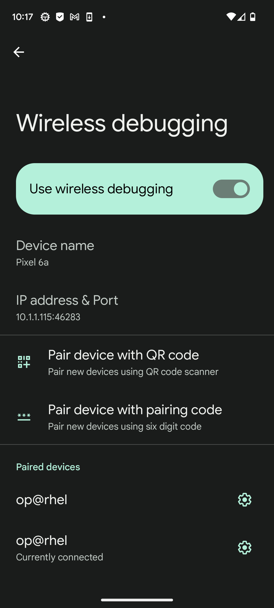
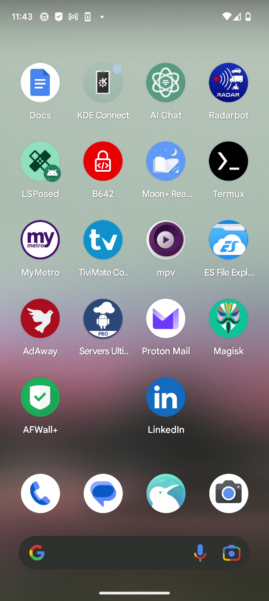

# How to Mirror ( and control) Your Android Device using SCRCPY

First thing first, make sure you have all the dependencies installed.

For Ubuntu

```console

# runtime dependencies
sudo apt install ffmpeg libsdl2-2.0-0 adb libusb-1.0-0

# client build dependencies
sudo apt install gcc git pkg-config meson ninja-build libsdl2-dev \
                 libavcodec-dev libavdevice-dev libavformat-dev libavutil-dev \
                 libswresample-dev libusb-1.0-0-dev

# server build dependencies
sudo apt install openjdk-11-jdk
```

For Fedora/RHEL/Rocky

```
# enable RPM fusion free
sudo dnf install https://download1.rpmfusion.org/free/fedora/rpmfusion-free-release-$(rpm -E %fedora).noarch.rpm

# client build dependencies
sudo dnf install SDL2-devel ffms2-devel libusb1-devel meson gcc make

# server build dependencies
sudo dnf install java-devel
```

Next, clone the respository https://github.com/Genymobile/scrcpy and cd into scrcpy/ and run the installation script

```
git clone https://github.com/Genymobile/scrcpy && cd scrcpy/ && ./install_release.sh

```

The script should help you build and install SCRCPY

Now if you happen to have `messon` installed from your package manager and pip at the same time, you might get an error while building the binary. Uninstall the one installed with pip first before running the installation script: 

```
pip3 uninstall meson

```


Now with Scrcpy installed, all you have to do is run with your phone connected with a cable or wirelessly.

With a cable, simple run `scrcpy` with no argument from the terminal.

If you want to run to mirror your phone wirelessly, first make sure you have the option `Wireless debugging` enabled from the developper option of your phone.

<p align="center">  </p>


From that option's settings, you can clearly see what's your ip address and the adb port. Keep in my that the adb port is generated randomly. If you turn off and turn back on wireless debugging, you will get a completely different port from what you previously had.

from the terminal, type

```
scrcpy --tcpip=192.168.1.1:5555

```

Replace 192.168.1.1 and 5555 with the ip and port I talked about earlier.

You should be good to go from there.

<p align="center">  </p>


Should you need to update `scrcpy` latter on, a simple `git pull` would get it up to date.


